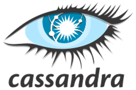
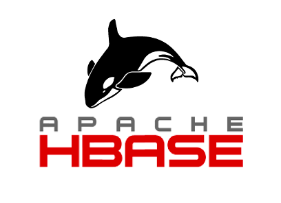
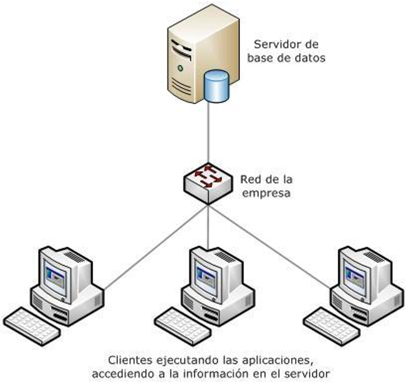

<style>

   .cite-author {
      text-align        : right;
   }
   .cite-author:after {
      color             : orangered;
      font-size         : 125%;
      /* font-style        : italic; */
      font-weight       : bold;
      font-family       : Cambria, Cochin, Georgia, Times, 'Times New Roman', serif;
      padding-right     : 130px;
   }
   .cite-author[data-text]:after {
      content           : " - "attr(data-text) " - ";
   }

   .cite-author p {
      padding-bottom : 40px
   }

</style>

<!-- _class: titlepage -->


<div class="title">Tema 1</div>
<div class="subtitle">Introducción a las bases de datos</div>
<div class="author">Grado en Ciencia de Datos e Inteligencia Artificial</div>
<div class="date">Curso 2021/2022</div>
<div class="organization">Departamento de Sistemas Informáticos</div>

[](https://creativecommons.org/licenses/by-nc-sa/4.0/)

---

# ¿Qué son los datos?

Corresponden a hechos o realidades del mundo real.

A partir de ellos, intentamos reconstruir la información del mundo real.

Son **almacenados** usando un método de comunicación (ej.: figuras o lenguajes) en un medio semipermanente de **registrarlos** (ej.: piedras o papel).

---

# ¿Qué son los datos?

**Generalmente**, el dato y su interpretación son recogidos juntos, en los lenguajes naturales

- Su altura es 175 cm
  - Dato: 175
  - Significado: altura en centímetros

**A veces**, los datos son separados de su interpretación

- Hora en un reloj
- Temperatura en un termómetro de la calle

---

# ¿Qué son los datos?

Los ordenadores han incrementado la separación entre datos y su significado:

- No se prestan para manipular en lenguaje natural
- El coste de almacenamiento es muy elevado

La interpretación de los datos es inherente a los programas que los utilizan:

- Dato: valores almacenados
- Información: significado de los datos

---

# Sistemas basados en ficheros

En los sistemas basados en ficheros cada programa utiliza sus propios datos: **ocupación** inútil de memoria, **inconsistencias** y **duplicidad** de información.

Además, existe **dependencia física** entre los programas y los datos:


---

# Sistemas basados en bases de datos

Cuando se utilizan bases de datos los programas **comparten** los datos:


---

# ¿Qué es una base de datos?

Conjunto de información (datos) **homogénea** de una organización, **almacenada** en un ordenador, y que permite realizar **consultas** y **actualizaciones** (inserciones, modificaciones y/o borrados).

Conjunto exhaustivo, con redundancia controlada de **datos estructurados**, fiables y homogéneos, organizados con **independencia** de su utilización y de su implementación en máquina, accesibles en tiempo útil, **compartibles** por usuarios concurrentes que tienen necesidades de información diferentes y no predecibles en el tiempo.

---

<!-- _class: transition -->

# MODELOS DE DATOS

---

# ¿Qué es un modelo de datos?

Un modelo de datos permite describir las propiedades de la información almacenada en una base de datos:

- Estructuras de datos
- Restricciones
- Dependencias
- Dominios

Los modelos de datos son fundamentales para introducir la abstracción en una base de datos.

---

# Tipos de modelos de datos

Modelos de datos **conceptuales**

- Describen las estructuras de datos y las relaciones de integridad
- Utilizados en la etapa de análisis

Modelos de datos **lógicos**

- Orientados a las operaciones
- Dependientes del tipo de base de datos utilizada

Modelos de datos **físicos**

- Estructuras de datos de bajo nivel usadas para almacenar información
- Dependientes del SGDB


---

# Modelo conceptual

Identifica las **entidades** que se van a almacenar en las base de datos:

- Ejemplo: alumnos, asignaturas, departamentos...

Modela las **relaciones** existentes entre las entidades:

- Ejemplo: los alumnos se matriculan de asignaturas.

Son cercanos al **mundo real**.

Ayudan a comunicarse con los clientes de las empresa de desarrollo.

---

# Modelo lógico

Incluyen las **relaciones** y **atributos** del modelo conceptual y está cercano a la base de datos.

La **normalización** se produce en este nivel: evita duplicidad de información.

Define conceptos propios de las bases de datos:

- **Claves primarias**: Ej. los alumnos son identificados de forma unívoca por su número de matricula.
- **Claves foráneas**: Ej. el alumno con número de matrícula aa0000 fue calificado con un 10 en la asignatura de bases de datos.

---

# Modelo físico

Definen *cómo* debe almacenarse la información en un dispositivo físico.

Altamente dependientes del SGBD<sup>1</sup> y de la versión del mismo.

Cercanos al sistema operativo.

Facilitan la rápida recuperación y manipulación de los datos almacenados.

> <sup>1</sup> Sistema gestor de bases de datos.

---

<!-- _class: transition -->

# TIPOS DE BASES DE DATOS

---

# Tipos de bases de datos


---

# BD relacionales

Cumplen con el modelo relacional: *normalización*

Es el tipo de base de datos más utilizado.

Utilizan el lenguaje SQL para consultar y manipular datos.

Los datos son almacenados en tablas:
- Es posible "unir" diferentes tablas para recuperar información


---

# Bases de datos no relacionales

No cumplen el modelo relacional. También llamadas `NoSQL`.

<div class="columns">
<div>

## Desventajas

- Consultas
- Normalización
- Dependencia

</div>
<div>

## Ventajas

- Flexibilidad
- Escalabilidad
- Velocidad

</div>
</div>

---

# Bases de datos documentales

La información es almacenada en documentos que contienen información semi-estructurada.

Escalabilidad vertical (máquina más potente) y horizontal (más máquinas).

Muy eficientes para la manipulación de datos.

Aconsejan duplicar información:

- Mejora el rendimiento de las consultas

Consultas muy limitadas.


---

# Bases de datos clave-valor

Almacena toda la información en pares `<clave, valor>`:

- La clave es única.
- El valor puede ser cualquier objeto.

Altamente divisibles, ofreciendo buena escalabilidad horizontal.

Suelen almacenarse en memoria.


---

# Bases de datos de alta escalabilidad

Bases de datos distribuidas.

Masivamente escalable (escalabilidad lineal).

Orientadas a columnas:

- Optimizadas para la completa recuperación de datos de columnas de datos (analítica de datos).

Pensadas para entornos con pocas escrituras.

 

---

# Bases de datos orientadas a grafos

Representan la información mediante un grafo:
- Nodos: entidades
- Aristas: relaciones

Completamente normalizadas: **no duplican información**.

Muy versátiles, aunque usan un lenguaje de consultas complejo.

Computacionalmente costosas.


---

<!-- _class: transition -->

# ARQUITECTURA CLIENTE-SERVIDOR

---

# Arquitectura cliente-servidor

Las bases de datos funcionan bajo una arquitectura cliente-servidor:

- La base de datos es el servidor
- Las aplicaciones que se conectan a la base de datos son los clientes

Esta arquitectura permite compartir los datos entre diferentes aplicaciones:

- Un solo servidor
- Múltiples clientes

---

# Infraestructura física

Habitualmente, la base de datos (servidor) y la aplicación (cliente) se separan en diferentes máquinas físicas.

Existe un protocolo de comunicación entre el cliente y el servidor.



---

# Ventajas

Se centraliza el acceso a los datos evitando inconsistencias.

Facilita la escalabilidad:

- Se puede aumentar la capacidad de clientes y servidores por separado.

Mejora el mantenimiento del sistema:

- El mantenimiento de la base de datos depende exclusivamente de la propia base de datos.

Facilita el desarrollo de aplicaciones al abstraerse de la gestión de los datos.

---

# Desventajas

Se puede congestionar el acceso a los datos si el ratio cliente/servidor no es adecuado.

No hay robustez frente a caídas o ataques al servidor:

- Este riesgo se minimiza si se replica el servidor

Existe dependencia de la conexión a la base de datos para el funcionamiento de la aplicación.

---

# Conexión con la base de datos

La conexión a base de datos se realiza a partir de un URL (**Universal Resource Location**).

Ejemplo:

```text
jdbc:mysql://mydb.com:3306/dbname
```

---

# Arquitectura ANSI-SPARC

<div class="columns">
<div>


</div>
<div>

- Permite vistas de usuario independientes y personalizadas.
- Oculta los detalles físicos de almacenamiento a los usuarios.
- El administrador de la base de datos debe ser capaz de cambiar las estructuras de almacenamiento de esta sin afectar la vista de los usuarios.
- La estructura interna de la base de datos no debería verse afectada por cambios en los aspectos físicos del almacenamiento.

</div>
</div>
